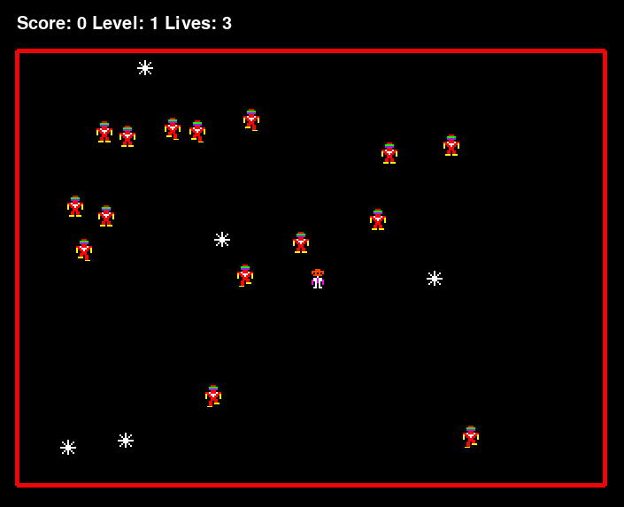

# Robotron 2084

This is a remake of the XBox (and older, using xbox graphics) game of Robotron 2084.



Working on simulating the XBox look and feel in an attempt to train a model and then test it on the console itself.

(See [my robotron player](https://github.com/stridera/robotron))

## Install

Insure you have python3 installed and venv. In ubuntu:

```bash
sudo apt install python3.8 python3.8-venv
```

Clone, setup venv, install requirements:

```bash
git clone git@github.com:stridera/robotron-2084.git
cd robotron-2084/
python3.8 -mvenv .venv
source .venv/bin/activate
pip install -r requirements.txt
```

Run the game:

```bash
python main.py
```

## OpenAI Gym

This was designed to have a similar structure to OpenAI Gym games. It supports the `reset()` and `step()` functions. You can look at [main.py](main.py) and see how it can be used.

### Functions

#### Initialization

Import the module and create the new env.

Example:

```python
import robotron

level = 1
fps = 30
env = robotron.Robotron(level, fps)
```

**Optional Parameters:**

_level_ - Default: 1
Specifies the level to start at. Useful for training a level the agent has a particularly hard time at.

_fps_ - Default: 0
Can be used to slow the game down for human players. 0 makes it play as quick as possible and should be used for computer agents.

**Returns**
Returns an image of the play area.

#### `reset()`

Resets the environment. Sets the level back to level 1, resets score and lives. Returns an image of the newly reset stage.

**Example**

```python
image = env.reset()
```

#### `step()`

Play one action on the env.

**Parameters:**

_action_ - int between 0 and 81 (9 \* 9)
This should be a integer that combines the two stick controls. You can either have a single agent that outputs 91, or you can have one agent for movement and one for shooting and construct it by doing the following:

```python
action = left * 9 + right
```

**Note**: You may wish to restrict this to 8\*8 and have your guy always moving and always shooting. There is usually no reason to ever stop and the limited action space may help your model.

**Returns:**

_image, reward, done, info_

- _Image_: The current frame of the game. Need to crop out the play area. Done this way to maintain parity with reading from the hdmi from the xbox.
- _reward_: The current score. Probably want to change this to make it return a better reward.
- _done_: All lives are exhausted. Game Over.
- _info_: Currently returns nothing. Added to maintain parity with the open ai gym.

**Example**

```python
image, reward, done, info = env.step(action)
```

## Notes

- There are no effect yet. You probably want to turn it to grayscale anyway, so it won't matter, but this is a post processing step you should do before sending it to your agent.
- Reward is currently just the score. I'll probably change this later to make it better score related and return score in the info.

## Todo

- [x] Create a pygame screen and draw the play area square.
- [x] Read the stylesheet and setup sprites.
- [x] Parse the wave info.
- [x] Add the player to the center.
  - [x] Allow him to run around and shoot bullets.
- [x] Add Grunts.
  - [x] Grunts run toward the player and they move sporadically.
  - [ ] Grunts speed up as the time advances on a stage.
- [x] Add Electrodes.
  - [x] Unlike companion cubes, Electrodes will stab you. Electrodes kill grunts and player.
- [ ] Add Family Members.
- [ ] Add Hulks.
- [ ] Add Brains.
- [ ] Add Spheroids.
- [ ] Add Enforcers.
- [ ] Add Quarks.
- [ ] Add Tanks.
- [ ] Properly handle rolling over level 40. (Waves restart at 21 and repeat.)
- [ ] Add flashing effects similar to in game.
- [ ] Add warp-in/warp-out effects.

## Attributions and Thanks

- Robotron 2084. Developed by Eugene Jarvis and Larry DeMar. Published by Williams Electronics.
- Sprite Sheet and definitions are from [Sean Riddle's Ripper page](https://seanriddle.com/ripper.html).
- Notes, score info, etc from [IGN's Robotron 2084 FAQ](https://www.ign.com/faqs/2005/robotron-2084-general-faq-430788)
